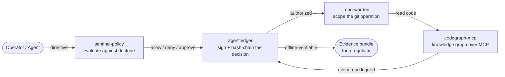

# Accountable AI Engineering

**An open suite for running AI agents you can *prove* are under control — on infrastructure you own, with code that never leaves it.**

The hard problem in production AI isn't whether the model is clever. It's the questions a board, a regulator, or an insurer asks afterward:

> **What did the agent do? Under whose authority? Can you prove it — offline, months later?**
>
> And: **can your agents understand your codebase without shipping it to someone else's cloud to be retained or trained on?**

Most stacks can't answer these. This suite is five small, focused, dependency-light tools that can — each useful alone, stronger together, all Apache-2.0, all on-prem by construction.

---

## The suite

| Tool | What it does | One-line pitch |
|------|--------------|----------------|
| [**codegraph-mcp**](https://github.com/cognis-digital/codegraph-mcp) | No-train code knowledge graph served to agents over MCP | Give agents real, structural code understanding — **6 languages, cross-language**, with an audit row for every read. Overlays the repos you already host. |
| [**agentledger**](https://github.com/cognis-digital/agentledger) | Signed, hash-chained flight recorder for agent directives | Prove who authorized every action. **Ed25519 · post-quantum ML-DSA · hybrid**, with key rotation continuity proofs and offline-verifiable evidence. |
| [**sentinel-policy**](https://github.com/cognis-digital/sentinel-policy) | Open governance doctrine + policy-gate engine | The **SENTINEL seven rules** plus a data-only policy engine that decides allow / deny / require-approval, each decision citing the rule. |
| [**repo-warden**](https://github.com/cognis-digital/repo-warden) | Git access governance over existing remotes | RFC 8628 device-flow auth, scoped revocable tokens, branch protection as a drop-in `pre-receive` hook. No forge migration. |
| [**cyclework**](https://github.com/cognis-digital/cyclework) | Iterative refinement engine | The propose → check → revise control loop as a first-class, inspectable object — for solvers, optimizers, and self-correcting agent loops. |

## How they compose

The four governance tools form one accountable path from an operator's intent to an agent's action against your code — and a tamper-evident record of all of it:



1. **sentinel-policy** decides whether a directive is permitted, and under which rule.
2. **agentledger** signs and chains that decision — including denials — into a tamper-evident ledger.
3. **repo-warden** scopes what the agent may actually do to your git repos.
4. **codegraph-mcp** gives the agent structural understanding of the code, logging every read.
5. At any point you export an **evidence bundle** a third party can verify with no access to your systems.

They're designed to snap together — e.g. a `sentinel-policy` decision drops straight into `agentledger`'s policy gate:

```python
from agentledger import Recorder, PolicyGate
from sentinel_policy import load_policy

policy = load_policy("policies/prod-controls.json")
gate = PolicyGate(default_allow=False).use(policy.as_gate_evaluator(defer_on_default=False))
rec = Recorder(gate=gate)                       # decisions are now signed + chained

decision, entry = rec.submit("alice", "deploy", {"env": "prod"})
```

See [`examples/integration.py`](examples/integration.py) for an end-to-end wiring.

## How it compares

The cloud code assistants are powerful but require sending your code to their infrastructure. The self-hosted alternatives make you migrate your hosting and leave the audit/PQC story on a roadmap. This suite is built for the regulated and high-stakes case — defense, finance, healthcare, gov — where neither is acceptable.

| | Cloud assistants | Self-hosted forge | **This suite** |
|---|---|---|---|
| Code leaves your machine | yes | no | **no** |
| Used to train a model | often | sometimes | **never** |
| Requires migrating your hosting | no | yes | **no — overlays existing repos** |
| Tamper-evident audit of agent actions | no | roadmap | **shipped** |
| Cross-language code dependency graph | partial | 2 languages | **6 languages** |
| Post-quantum signing | — | roadmap | **shipped (ML-DSA-65 + hybrid)** |
| Key rotation with continuity proofs | — | — | **shipped** |
| Published, reproducible benchmark | — | none | **yes** |
| Runs air-gapped | no | heavy | **standard library + SQLite** |

## Why it's different

- **No training, ever.** Nothing here ingests your code to rank, sell, or train a model.
- **Overlay, not migration.** Point the tools at the repos and remotes you already run.
- **Provable, offline.** Hash-chained ledgers, cryptographic signatures, and evidence bundles a regulator can verify with no call back to any vendor.
- **Boring on purpose.** Small, readable, dependency-light Python + SQLite. Easy to vet, easy to run in a restricted network.

## Get started

Each tool installs and runs on its own:

```bash
pip install -e .   # in any of the repos below
```

- codegraph-mcp → https://github.com/cognis-digital/codegraph-mcp
- agentledger → https://github.com/cognis-digital/agentledger
- sentinel-policy → https://github.com/cognis-digital/sentinel-policy
- repo-warden → https://github.com/cognis-digital/repo-warden
- cyclework → https://github.com/cognis-digital/cyclework

## License

Apache-2.0. © Cognis Digital. Every tool in the suite is Apache-2.0 — including the SENTINEL governance doctrine, published openly so you can argue with the rules on their merits.
