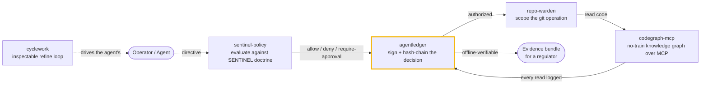
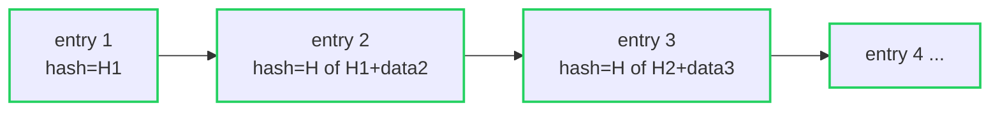
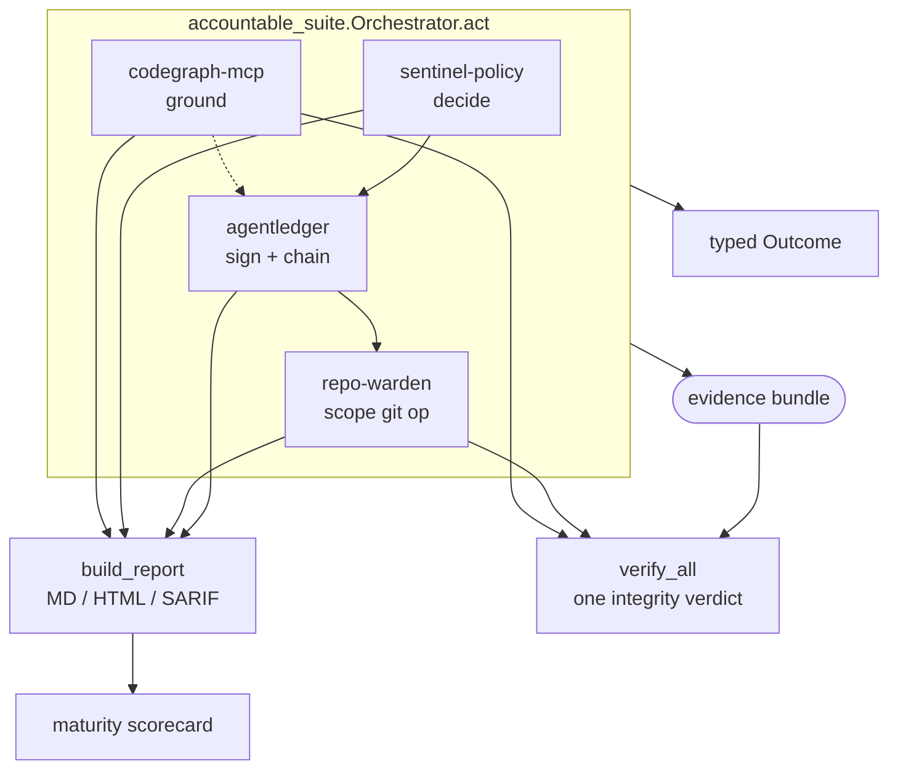

# Architecture

The Accountable AI Engineering suite is not a monolith. It is five small,
independently useful tools — each in its own repo, each `pip install`-able and
testable on its own — that **compose into one accountable path** from an
operator's intent to an agent's action against your code, with a tamper-evident
record of all of it.

This repo is the umbrella: the story that ties the five together, a runnable
end-to-end example ([`examples/integration.py`](../examples/integration.py)), a
set of audience-targeted demos ([`demos/`](../demos/)), and a **capstone package**
([`accountable_suite`](../accountable_suite/)) that makes the umbrella
executable — an orchestrator, a unified compliance report, a one-shot integrity
verify, and a maturity scorecard. See [CAPSTONE.md](CAPSTONE.md).

## How the pieces compose

A policy **decides**, the ledger **proves**, the warden **scopes**, the graph
**informs**, and the loop the agent runs is **inspectable** — and at any moment
you export evidence a third party verifies with no access to your systems.

## The five components

### sentinel-policy — *the doctrine and the decision engine*
Two things ship: the **SENTINEL doctrine** (seven plainly-stated rules for
governing an autonomous agent — `S1` Attributed Intent through `S7` Provable
Refusal) and a dependency-free engine that turns a file-backed policy into
`allow` / `deny` / `require_approval` decisions. **Every decision cites the
doctrine rule it serves** (`Decision.doctrine`), so a reviewer traces any
outcome back to a stated principle rather than a vibe. Its `Decision` objects
are drop-in for agentledger's policy-gate hook (`Policy.as_gate_evaluator`).

### agentledger — *the flight recorder*
A vendor-neutral, signed, hash-chained ledger of operator directives. Each
directive is **signed** (Ed25519 by default, post-quantum ML-DSA when the
runtime offers it, HMAC fallback otherwise) and each entry's hash commits to the
previous one, so the history can't be silently edited or reordered. It adds
**m-of-n approvals** for gated escalation (`approve` / `approval_status`),
**key rotation with continuity proofs** (`rotate_key`), and **evidence bundles**
(`export_evidence` / `verify_bundle`) — a single JSON file a third party
validates offline.

### repo-warden — *git access governance over remotes you already run*
Layers authorization on top of existing git hosts. Agents and humans obtain
access via the **OAuth 2.0 Device Authorization Grant (RFC 8628)** — the
headless copy-a-code flow that fits CI — receiving a **scoped, revocable token**
bound to a repo namespace (`acme/*`). A **branch-protection policy** decides
each push/read/delete and can be enforced as a drop-in server-side
`pre-receive` hook. Only a hash of each token is stored; revocation is
immediate.

### codegraph-mcp — *no-train code understanding, served over MCP*
Turns a repository into a queryable knowledge graph (symbols, calls, references,
cross-language HTTP edges) and serves it to agents over MCP — so an agent reads
**real structure from code it is never trained on**, locally, with an audit row
for every read. In the suite, it is the "informs" leg: grounded understanding
that feeds the agent before it acts.

### cyclework — *the agent's loop as an inspectable object*
The propose → check → revise loop made first-class. You supply a `check`
(returns a `Verdict` with `ok` / `score` / `feedback`) and a `revise`; the
`Engine` runs the cycle, detects convergence and plateaus, enforces a budget,
and returns a full **trace** of every iteration. It replaces the agent's
opaque `while` with something you can audit step by step.

## The capstone layer

Composing five tools by hand is instructive but not what you want in production.
The `accountable_suite` package collapses the path into one call and adds the
cross-tool views that only make sense over all of them at once:

- **`Orchestrator`** — `act()` = decide → sign → scope → (ground); returns a
  typed `Outcome`, exports an offline-verifiable bundle.
- **`build_report`** — one Markdown/HTML/SARIF/JSON document aggregating every
  tool; doctrine gaps and denied authorizations become SARIF findings.
- **`verify_all`** — one integrity verdict across the evidence bundle, warden
  audit, and graph audit; the bundle path is pure-Python and offline.
- **`build_scorecard`** — five SENTINEL-aligned dimensions, scored from live
  signals, mapped to a maturity level.

Every capability degrades gracefully when a tool is absent — the same code runs
in CI (four tools) and on a full local checkout (five).

## Why these boundaries

- **Independent, then composable.** Each tool solves one named pain on its own
  (see the README's *Start where it hurts*). Nothing forces adoption of the
  rest; the seams (`Decision` shape, `PolicyGate.use`, scoped tokens, evidence
  bundles) are what let them snap together.
- **On-prem, no training, no vendor call.** Code never leaves your machine and
  is never used to train a model. Evidence verifies offline.
- **Boring on purpose.** Small, readable, dependency-light Python + SQLite —
  easy to vet, easy to run in a restricted network.

## Verified, not claimed

CI installs the three governance packages from source and runs
[`examples/integration.py`](../examples/integration.py) on every commit, so
"they compose" is checked on every push. The [demos](../demos/) and the test
suite exercise the same composed paths.
